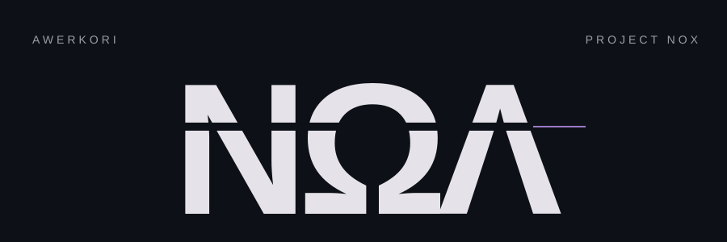
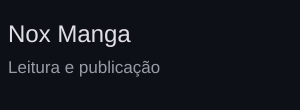
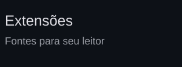
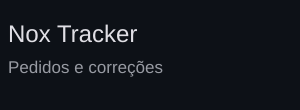

<picture>
  <source media="(max-width: 600px)" srcset="./assets/branding/editorial-mobile.svg">
  
</picture>

Criando e cuidando do Project Nox.

 

  <a href="https://github.com/Awerkori/project-nox-manga"><picture><source media="(max-width: 600px)" srcset="./assets/projects/selected-reading-mobile.svg"></picture></a>
  <a href="https://github.com/Awerkori/extensoes"><picture><source media="(max-width: 600px)" srcset="./assets/projects/selected-sources-mobile.svg"></picture></a>
  <a href="https://github.com/Awerkori/project-nox-tracker"><picture><source media="(max-width: 600px)" srcset="./assets/projects/selected-tracker-mobile.svg"></picture></a>

NΩΛ

