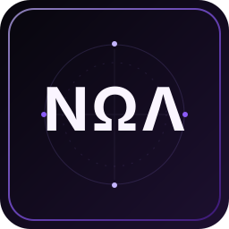

  

  <a href="https://github.com/Awerkori?tab=repositories">PROJECTS</a>
  &nbsp;&nbsp;•&nbsp;&nbsp;
  <a href="https://github.com/Awerkori/project-nox-manga">WEB</a>
  &nbsp;&nbsp;•&nbsp;&nbsp;
  <a href="https://github.com/Awerkori/project-nox-tracker">COMMUNITY</a>

  
   
  WEB · READING · TOOLS · COMMUNITY

 

<table>
  <tr>
    <td align="center" width="50%">
       
      <a href="https://github.com/Awerkori/project-nox-manga"><strong>Project Nox Manga</strong></a> 
      reading + publishing
    </td>
    <td align="center" width="50%">
       
      <a href="https://github.com/Awerkori/fonte-extensoes"><strong>Fonte Extensões</strong></a> 
      source infrastructure
    </td>
  </tr>
  <tr>
    <td align="center" width="50%">
       
      <a href="https://github.com/Awerkori/project-nox-tracker"><strong>Nox Tracker</strong></a> 
      requests + signal
    </td>
    <td align="center" width="50%">
       
      <a href="https://github.com/Awerkori/project-nox-importer"><strong>Nox Importer</strong></a> 
      tools + integration
    </td>
  </tr>
</table>

   
  Svelte · TypeScript · Kotlin · Python · PostgreSQL
    
  
   
  NΩΛ / PROJECT NOX

