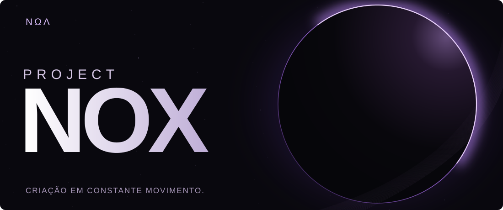
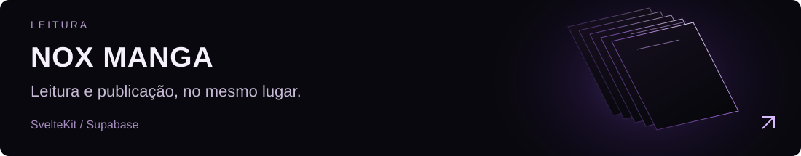
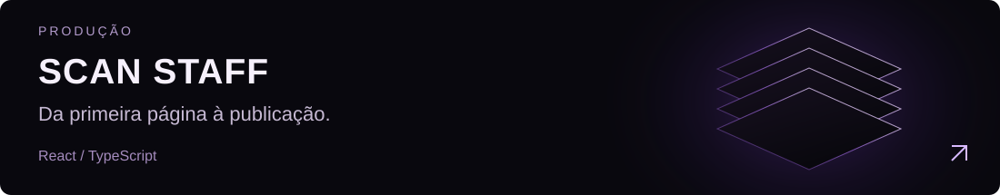
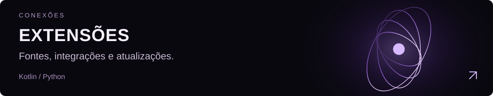
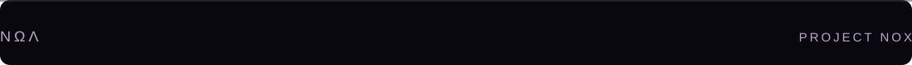

<picture>
  <source media="(max-width: 600px)" srcset="./assets/branding/eclipse-mobile.svg">
  
</picture>

Um projeto independente que reúne ideias, ferramentas e serviços feitos para ganhar vida. Criado e mantido por **Awerkori**.

<a href="https://github.com/Awerkori/project-nox-manga">
<picture>
  <source media="(max-width: 600px)" srcset="./assets/projects/manga-mobile.svg">
  
</picture>
</a>

<a href="https://github.com/Awerkori/project-nox-scan-staff">
<picture>
  <source media="(max-width: 600px)" srcset="./assets/projects/staff-mobile.svg">
  
</picture>
</a>

<a href="https://github.com/Awerkori/fonte-extensoes">
<picture>
  <source media="(max-width: 600px)" srcset="./assets/projects/extensions-mobile.svg">
  
</picture>
</a>

Tem uma ideia ou encontrou algo para melhorar? [Converse com o Nox →](https://github.com/Awerkori/project-nox-requests/issues)

<picture>
  <source media="(max-width: 600px)" srcset="./assets/ui/signature-mobile.svg">
  
</picture>
