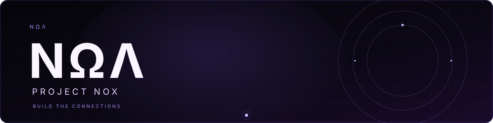
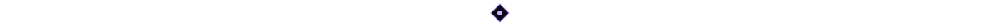
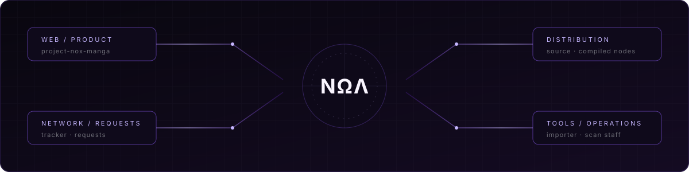

  

  <code>NΩΛ / PROJECT NOX</code> 
  ONE SYSTEM · MANY SURFACES

  

## 01 // NOX

**Project Nox** is an evolving ecosystem for building the surfaces, tools and connections around digital publishing and reading.

It is not one app, one stack or one repository. Web products, scan operations, extension infrastructure, distribution layers and automation are separate nodes in the same system.

Extensions are one node in the network — not the definition of Nox.

`Awerkori` maintains the network. `NΩΛ` is its signal.

## 02 // SYSTEM MAP

  

## 03 // NODES

### WEB / PRODUCT

[`project-nox-manga`](https://github.com/Awerkori/project-nox-manga) — reading and publishing platform at the product edge of the ecosystem.

### EXTENSION NETWORK

[`fonte-extensoes`](https://github.com/Awerkori/fonte-extensoes) — source layer: custom sources, repairs and synchronized extension development.

[`extensoes`](https://github.com/Awerkori/extensoes) · [`anime-fonte-extensoes`](https://github.com/Awerkori/anime-fonte-extensoes) · [`anime-extensoes`](https://github.com/Awerkori/anime-extensoes) — compiled distribution and the parallel anime source network.

### NETWORK / REQUESTS

[`project-nox-tracker`](https://github.com/Awerkori/project-nox-tracker) — visible signal for requests, fixes and source demand.

[`project-nox-requests`](https://github.com/Awerkori/project-nox-requests) — the intake layer where new nodes and repairs enter the system.

### TOOLS / OPERATIONS

[`project-nox-importer`](https://github.com/Awerkori/project-nox-importer) — import and integration tooling.

[`project-nox-scan-staff`](https://github.com/Awerkori/project-nox-scan-staff) — operational surface for scan production and coordination.

## 04 // DEVELOPMENT SIGNAL

The public nodes currently speak through:

`WEB`  Svelte · TypeScript · JavaScript · HTML/CSS 
`SOURCE`  Kotlin · Java · Python 
`OPERATIONS`  PostgreSQL · Shell · GitHub Actions

The stack is a means. The system is the product.

## 05 // NETWORK

| NODE | LINK |
|---|---|
| Source distribution | [Awerkori/extensoes](https://github.com/Awerkori/extensoes) |
| Request signal | [Project Nox Tracker](https://github.com/Awerkori/project-nox-tracker) |
| Manga surface | [Project Nox Manga](https://github.com/Awerkori/project-nox-manga) |
| Anime surface | [Project Nox Anime](https://github.com/Awerkori/anime-extensoes) |

  
    
  NΩΛ // PROJECT NOX · BUILD THE CONNECTIONS

