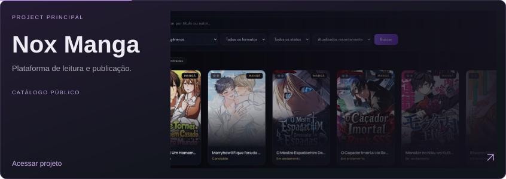
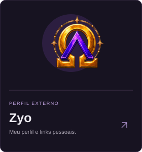
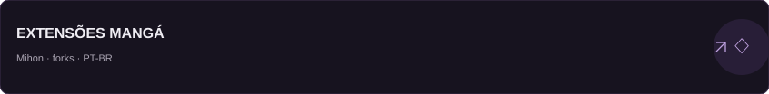
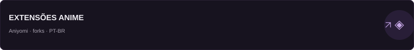
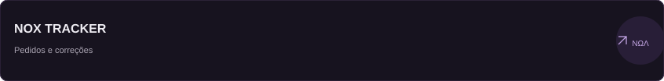

<picture>
  <source media="(prefers-reduced-motion: reduce) and (max-width: 600px)" srcset="./assets/profile/identity-mobile-still.svg">
  <source media="(prefers-reduced-motion: reduce)" srcset="./assets/profile/identity-still.svg">
  <source media="(max-width: 600px)" srcset="./assets/profile/identity-mobile.svg">
  
</picture>

 

  

Dados de atividade atualizados automaticamente pelo workflow do perfil.

