<picture>
  <source media="(prefers-reduced-motion: reduce) and (max-width: 600px)" srcset="./assets/branding/nox-mobile-still.svg">
  <source media="(prefers-reduced-motion: reduce)" srcset="./assets/branding/nox-still.svg">
  <source media="(max-width: 600px)" srcset="./assets/branding/nox-mobile.svg">
  
</picture>

Crio ferramentas, espaços de leitura e outras ideias no Project Nox.

<a href="https://github.com/Awerkori?tab=repositories">Meus projetos</a> &nbsp;·&nbsp; <a href="https://github.com/Awerkori/project-nox-requests/issues">Sugestões e pedidos</a>
