<picture>
  <source media="(prefers-reduced-motion: reduce) and (max-width: 600px)" srcset="./assets/branding/nightfall-mobile-still.svg">
  <source media="(prefers-reduced-motion: reduce)" srcset="./assets/branding/nightfall-still.svg">
  <source media="(max-width: 600px)" srcset="./assets/branding/nightfall-mobile.svg">
  
</picture>

Entre código, histórias e ideias que viram projetos.

<a href="https://github.com/Awerkori?tab=repositories">O que estou criando</a> &nbsp; / &nbsp; <a href="https://github.com/Awerkori/project-nox-requests/issues">Ideias e pedidos</a>

