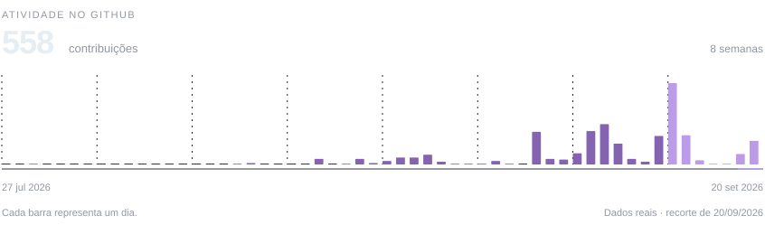

<picture>
  <source media="(max-width: 600px)" srcset="./assets/profile/identity-mobile.svg">
  
</picture>

  

<picture>
  <source media="(max-width: 600px)" srcset="./assets/profile/activity-mobile.svg">
  
</picture>

ALÉM DO GITHUB

NΩΛ · Awerkori × Project Nox

